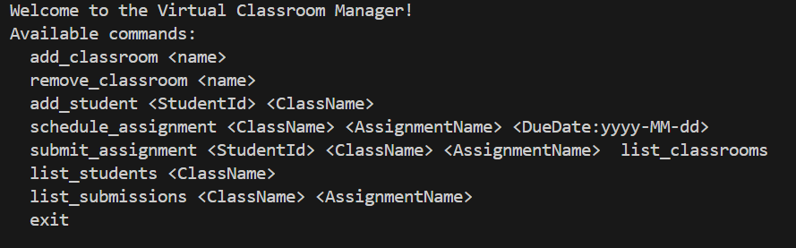
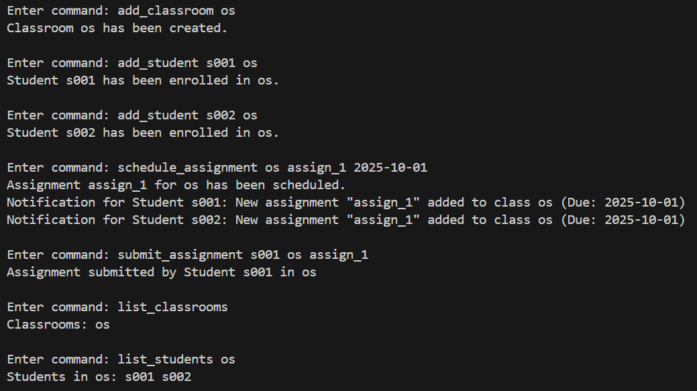
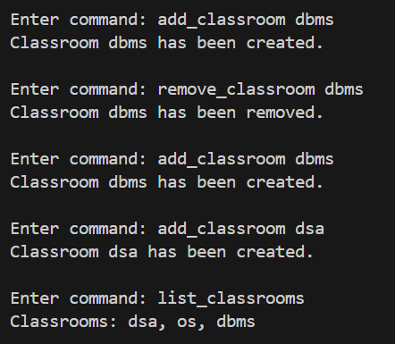
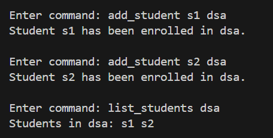
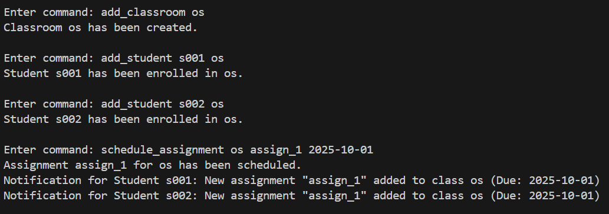
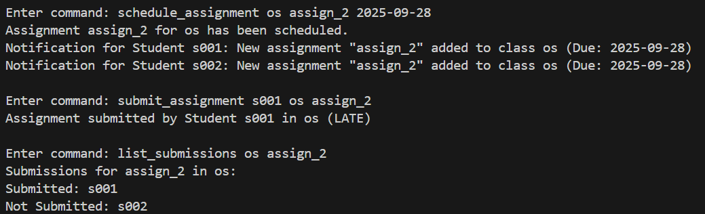

# Virtual Classroom Manager

## Use Case

The **Virtual Classroom Manager** simulates a terminal-based EdTech platform backend.
It allows management of **classrooms, students, and assignments** with real-time notifications to students.

### Problem Statement 

To develop a backend for managing classrooms, where:

1. **Classroom Management**: Add, list, and remove classrooms.
2. **Student Management**: Enroll students into classrooms and list students.
3. **Assignment Management**: Schedule assignments for classrooms and allow students to submit them.

### Functional Requirements

* **Classroom Addition** → Classroom [Name] has been created.
* **Student Addition** → Student [ID] has been enrolled in [Class Name].
* **Assignment Scheduled** → Assignment [Name] for [Class Name] has been scheduled.
* **Assignment Submission** → Assignment submitted by Student [ID] in [Class Name].

## What I Implemented

### Core Features (From PS)

* add_classroom <name> → Create classrooms
* add_student <StudentId> <ClassName> → Enroll students
* schedule_assignment <ClassName> <AssignmentName> <DueDate> → Schedule assignments
* submit_assignment <StudentId> <ClassName> <AssignmentName> → Submit assignments
* list_classrooms → Show classrooms
* list_students <ClassName> → Show students in a class
* exit → Quit program

### Additional Features implemented

1. **Remove Classroom** → remove_classroom <ClassName>

   * Lets users remove classrooms.

2. **Observer Pattern (Notifications)**

   * Students get notified when new assignments are scheduled.
   * If a student joins late, they get reminders of already scheduled assignments.

3. **Submission Tracking**

   * New command → list_submissions <ClassName> <AssignmentName>
   * Shows **Submitted** and **Not Submitted** students.

4. **Error Handling with Custom Exceptions**

   * Handles invalid commands, duplicate classrooms, missing classrooms, missing assignments, invalid dates, etc.

5. **Factory Pattern**

   * StudentFactory and AssignmentFactory used for object creation.

## Design Patterns Used

1. **Factory Pattern**

   * Used for creating Student and Assignment objects.
   * Ensures flexible and consistent object creation.

2. **Observer Pattern**

   * Students (Observers) get notified when:

     * New assignments are scheduled.
     * A student enrolls after assignments are already scheduled.

3. **Command Pattern**

   * VirtualClassroomManager.handleCommand() processes user commands in a structured way.

## Screenshots

### Welcome Screen

### Sample screenshots (given in ps)

### Classroom Management Commands

### Student Management Commands

### Assignment Scheduling

### Assignment Submissions

